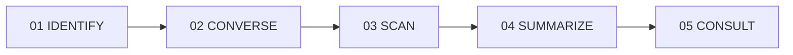

# MediKiosk — AI Clinical Intake & Triage Platform

[](https://medikiosk-platform.vercel.app)
[](https://react.dev)
[](https://vitejs.dev)
[](https://abdm.gov.in)
[](https://hl7.org/fhir)

> **Turn Patient Stories Into Clinical Intelligence.**  
> MediKiosk captures patient history in 14 Indian languages, digitizes physical medical records using on-device OCR, and generates structured clinical summaries (SOAP & Dashavidha Pariksha) before consultation.

---

## 🌐 Live Production Deployment
* **Live Web App**: [https://medikiosk-platform.vercel.app](https://medikiosk-platform.vercel.app)
* **Direct Hero Video Public Stream**: [https://medikiosk-platform.vercel.app/videos/GENERATE_IT.mp4](https://medikiosk-platform.vercel.app/videos/GENERATE_IT.mp4)

---

## 🩺 Key Features & Clinical Flow



1. **01 IDENTIFY — Demographic & ABHA Onboarding**:
   * Multi-language audio guide support (14 Indian Languages: Hindi, Tamil, Bengali, Telugu, Marathi, English, etc.).
   * ABHA ID scan/entry with explicit digital consent management.
2. **02 CONVERSE — Adaptive Clinical Intake**:
   * Speech-to-text with conversational AI intake.
   * Real-time Red-Flag triage logic with automated ESI Level 2 Priority routing.
3. **03 SCAN — Document OCR & Longitudinal Timeline**:
   * Instant OCR extraction of lab reports, prescriptions, and discharge summaries.
   * Automatic Sulfa allergy detection and 2019–Present clinical timeline synthesis.
4. **04 SUMMARIZE — Structured SOAP & Pariksha Draft**:
   * AI-synthesized clinical intake notes ready for physician sign-off.
   * Dual-mode clinical architecture: **Allopathic SOAP** or **AYUSH Dashavidha Pariksha** (Prakriti, Vikriti, Sara, Samhanana, Pramana, Satmya, Sattva, Ahara/Vyayama Shakti, Vaya).
5. **05 CONSULT — Physician Cockpit Suite**:
   * Pre-consultation intelligence delivered to doctors with zero manual transcription.

---

## 🚀 Technical Architecture

* **Frontend**: React 19, Lucide Icons, Canvas Confetti.
* **Build System**: Vite 8.2 with optimized asset pipeline.
* **Styling**: Vanilla CSS design system with custom typography, dark cinematic hero overlays, and responsive mobile drawers.
* **Public Assets**: Static MP4 video background served project-relative via `/videos/GENERATE_IT.mp4`.
* **Deployment**: Continuous production deployment on Vercel (`vercel.json` SPA configuration).

---

## 🛠️ Local Development

```bash
# Clone the repository
git clone https://github.com/SAYANCHARABORTY/medikiosk-platform.git
cd medikiosk-platform

# Install dependencies
npm install

# Start local development server
npm run dev

# Build production bundle
npm run build

# Preview production build locally
npm run preview
```

---

## 📄 License

MIT © [Sayan Chakraborty](https://github.com/SAYANCHARABORTY)
